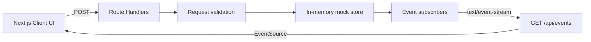

# Vault·X 交易所充提 Demo

一个最小但完整的 Next.js 交易所充值与提取演示项目。支持站内 UID 和链上两种资金通道，提取时校验手机、邮箱与 Google 验证器三项 Mock 验证码，并通过 Server-Sent Events 实时推送交易状态。

> 此项目仅供演示。它使用内存数据、模拟地址和固定验证码，**不处理任何真实资产**。

## 功能

- **充值**
  - 站内 UID 充值：核验付款方 UID，模拟即时入账。
  - 链上充值：按币种选择 TRON、Ethereum 或 Bitcoin 网络，展示模拟充值地址与确认进度。
- **提取**
  - 站内 UID 提取：转入目标 UID。
  - 链上提取：校验网络和收款地址，模拟广播与完成状态。
  - 所有提取都要求手机、邮箱、Google 验证器三项验证同时通过。
- **SSE 实时推送**
  - 首次连接推送当前交易快照。
  - 交易创建和状态变更时立即推送。
  - 15 秒心跳、浏览器自动重连与 `retry: 3000` 重试提示。
- **工程化**
  - TypeScript 严格模式、ESLint、Vitest 和 GitHub Actions CI。
  - 响应式交易所资金账户界面。

## 快速开始

需要 Node.js `>= 20.9.0`。

```bash
git clone https://github.com/thunderxu7-sketch/exchange-wallet-demo.git
cd exchange-wallet-demo
npm install
npm run dev
```

打开 [http://localhost:3000](http://localhost:3000)。项目不需要环境变量或外部服务。

## Mock 验证码

| 验证项 | 验证码 |
| --- | --- |
| 手机验证码 | `123456` |
| 邮箱验证码 | `234567` |
| Google 验证器 | `345678` |

界面中每个验证项都有「填入 Mock」按钮。提取 API 会在服务端再次校验三个值。

## API

### 站内 UID 充值

```bash
curl -X POST http://localhost:3000/api/deposits \
  -H 'Content-Type: application/json' \
  -d '{
    "rail": "internal",
    "asset": "USDT",
    "amount": 100,
    "sourceUid": "UID-580219"
  }'
```

### 链上充值

```bash
curl -X POST http://localhost:3000/api/deposits \
  -H 'Content-Type: application/json' \
  -d '{
    "rail": "onchain",
    "asset": "USDT",
    "amount": 100,
    "network": "TRON"
  }'
```

### 链上提取

```bash
curl -X POST http://localhost:3000/api/withdrawals \
  -H 'Content-Type: application/json' \
  -d '{
    "rail": "onchain",
    "asset": "USDT",
    "amount": 50,
    "network": "TRON",
    "address": "TVnD3moReceiver9Qx8K2pL5sW7yA4cB6",
    "phoneCode": "123456",
    "emailCode": "234567",
    "authenticatorCode": "345678"
  }'
```

### SSE 事件流

```bash
curl -N http://localhost:3000/api/events
```

浏览器端使用原生 `EventSource`：

```ts
const source = new EventSource("/api/events");

source.onmessage = (message) => {
  const event = JSON.parse(message.data);
  console.log(event.type, event);
};
```

事件类型：

| `type` | 含义 |
| --- | --- |
| `snapshot` | 新连接的完整交易快照 |
| `transaction.created` | 新充值或提取申请 |
| `transaction.updated` | 确认数、审核、处理或完成状态更新 |

## 架构



```text
src/
├── app/
│   ├── api/deposits/route.ts
│   ├── api/withdrawals/route.ts
│   ├── api/events/route.ts
│   └── page.tsx
├── components/
│   └── exchange-dashboard.tsx
└── lib/exchange/
    ├── store.ts
    ├── types.ts
    ├── validation.ts
    └── validation.test.ts
```

`store.ts` 通过 `globalThis` 在本地 Next.js 热更新期间保留单进程状态。它不适合多实例或 Serverless 生产环境；生产实现应替换为持久化数据库和 Redis/NATS/Kafka 等跨实例事件总线。

## 质量检查

```bash
npm run lint
npm run typecheck
npm test
npm run build
```

GitHub Actions 会在 `main` 分支推送和 Pull Request 中执行全部四项检查。

## License

[MIT](./LICENSE)
